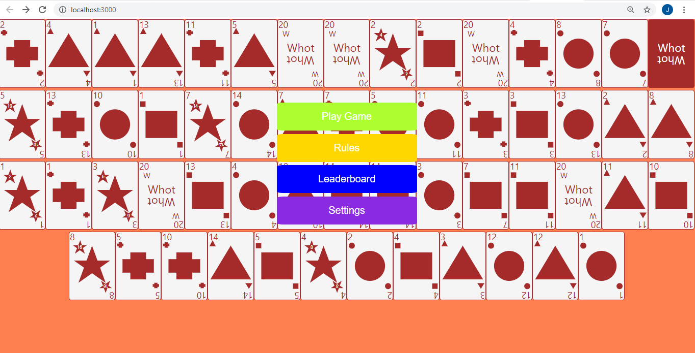
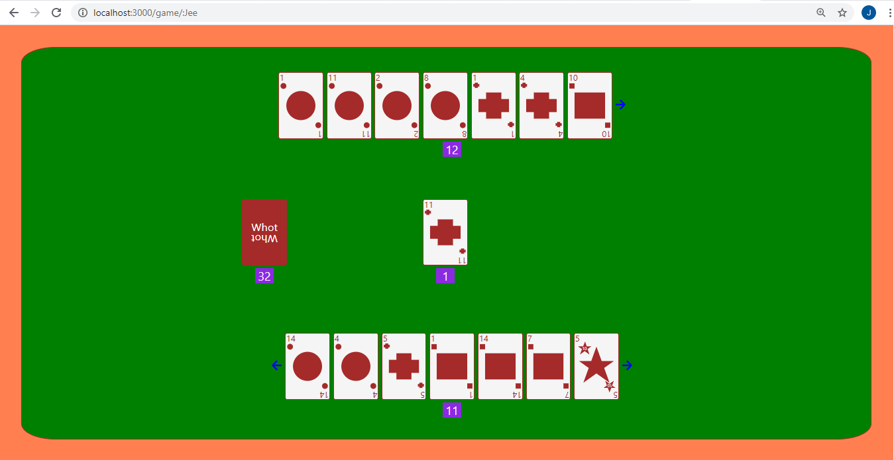

# WHOT

This project is aimed at playing the game of Whot, with agents powered by Reinforcement learning, the whot game is a card game, between two or more players the goal of the game is to eliminate the number of cards in the hands of the players the game has variable rule but the goal is that the first person to have no card at hand wins the game or at the end of the game the person with the highest number of cards at hand loses the game, the number of cards is counted by summing the numbers in each card but stars are multiplied by two

Desktop View


Mobile View


Desktop View



## Rules

I have made the game in such a way that the rules are flexible to and cand the turned on and off

### hold On
if this value is true any card with the a number 1, put the next player on hold for one round

### pick Two
if this value is true any card with the a number 2, makes the next player to pick two cards from the market and put him or her on hold

### pick Three
if this value is true any card with the a number 5, makes the next player to pick three cards from the market and put him or her on hold

### suspension
if this value is true any card with the a number 8, put the next player on suspension for one round

### general Market
if this value is true any card with the a number 14, all the next player to pick one card sequencially from the market and put all players on hold

### need
if this value is true any card with the a number 20, gives the player the ability to request any card shape of his choice this card can be played on any card


## Agents

The agent learns from its interations with other agents and users that play against it this improve the angents experience


# config
goto the Config forder create a file dev.js under the forder and insert the code below into the file dev.js

```javascript

module.exports = {
    DataBaseURI: "your mongodb uri",
}

```


